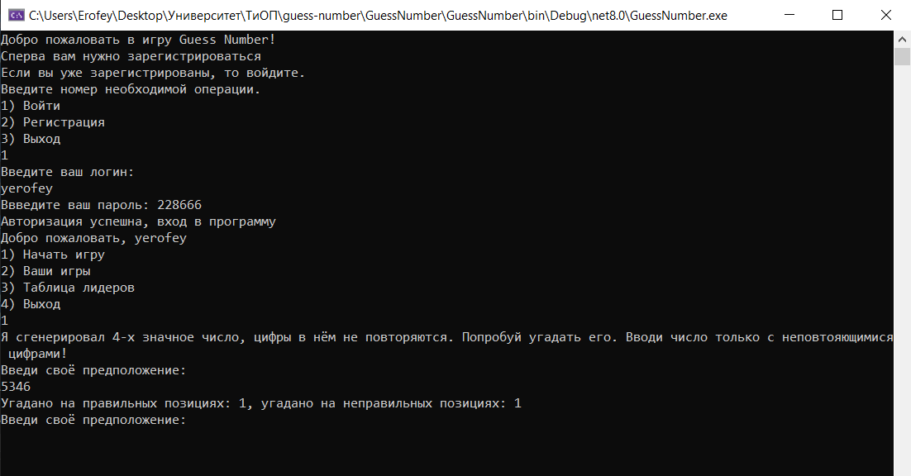

# Guess the Number Game
Welcome to the "Guess the Number" game! In this game, the computer randomly selects a 4-digit number with unique digits. Your task is to guess this number in the fewest attempts possible.

Game Description
Secret Number: The computer randomly generates a 4-digit number consisting of unique digits (from 0 to 9).
Attempts: Players enter their guesses, and after each attempt, they receive feedback.
Feedback: After each guess, the game informs:
The number of correctly guessed digits.
The number of digits that are in the correct position.

Game Rules
The computer selects a 4-digit number with unique digits.
The player enters a 4-digit number, also consisting of unique digits.
The game provides feedback on the number of guessed digits and their positions.
The game continues until the player guesses the secret number.
Example Gameplay
The computer has chosen the number: 1234
The player enters: 5678
Response: 0 guessed digits, 0 in the correct position.
The player enters: 1230
Response: 2 guessed digits, 1 in the correct position.
The player enters: 1324
Response: 4 guessed digits, 4 in the correct position.
Congratulations! You have guessed the number!

# Number generating code
````C#
        static string GetRandomNumberString()
        {
            Random random = new Random();

            int firstDigit = random.Next(0, 10);
            List<int> digits = new List<int> { firstDigit };

            while (digits.Count != 4)
            {
                int digit = random.Next(0, 10);

                if (!digits.Contains(digit))
                {
                    digits.Add(digit);
                }
            }

            string numberString = string.Join("", digits);
            return numberString;
        }
````
### Photo of my game: 

